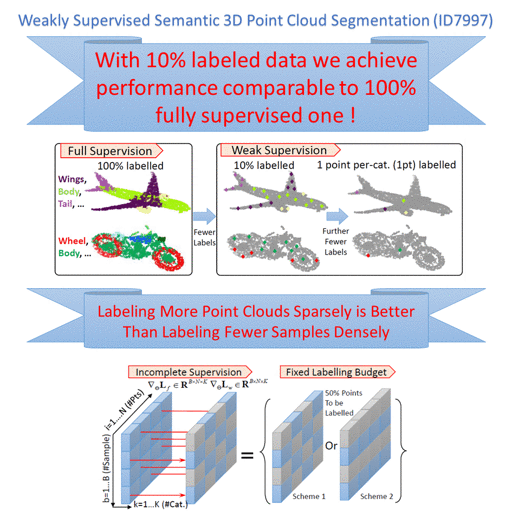

## Weakly Supervised Semantic Point Cloud Segmentation: Towards 10x Fewer Labels (Under Construction)
Created by <a href="http://xu-xun.com" target="_blank">Xun Xu</a> and <a href="https://www.comp.nus.edu.sg/~leegh/" target="_blank">Gim Hee Lee</a> from National University of Singapore.

### Introduction
This work is based on our CVPR2020 paper <a href="https://arxiv.org/abs/2004.04091">Weakly Supervised Semantic Point Cloud Segmentation: Towards 10X Fewer Labels</a>. We studied 3D point cloud segmentation under a weakly supervised scenario. It is assumed that only a fraction (less than 10% in our experiments) of points are provided with ground-truth. We revealed that with such few labeled data, semantic segmentation performance is very close to the fully supervised method (100% data points labeled). We further introduce additional constraints for unlabeled data and achieved comparable results to fully supervised ones.

We release tensorflow code for experiments on ShapeNet [1] and S3DIS [2] datasets. You are welcome to report any bugs you would identify. Should you have any concerns or experience any issues please raise in Issues so that all people can benefit from the discussions.

### Citation
Please cite the following work if you feel it is helpful.

@Inproceedings{XuLee_CVPR20,
title={Weakly Supervised Semantic Point Cloud Segmentation: Towards 10x Fewer Labels},
author={Xu, Xun and Lee, Gim Hee},
booktitle={CVPR}
year={2020},
}

### Installation
This code has been tested on Pyhon3.6, TensorFlow1.14, CUDA 10.0, cuDNN 7.0 and Ubuntu 18.04

### Usage
You should first download the data for ShapeNet and/or S3DIS by running:

	bash prepareDataset_ShapeNet.sh
	

You can then train the full model by running:

	python train_ShapeNet.py
	

For inference you should first locate the saved training result by the exact date and time in the format year-month-day_hour-min-sec, e.g. 2020-06-17_07-45-44, and then run:

	python test_ShapeNet.py -dt year-month-day_hour-min-sec
	

Reference:

[1] Li Yi, Vladimir G Kim, Duygu Ceylan, I Shen, Mengyan Yan, Hao Su, Cewu Lu, Qixing Huang, Alla Sheffer, Leonidas Guibas, et al. A scalable active framework for region annotation in 3d shape collections. ACM Transactions on Graphics, 2016.

[2] Iro Armeni, Ozan Sener, Amir R Zamir, Helen Jiang, Ioannis Brilakis, Martin Fischer, and Silvio Savarese. 3d semantic parsing of large-scale indoor spaces. In CVPR, 2016.
